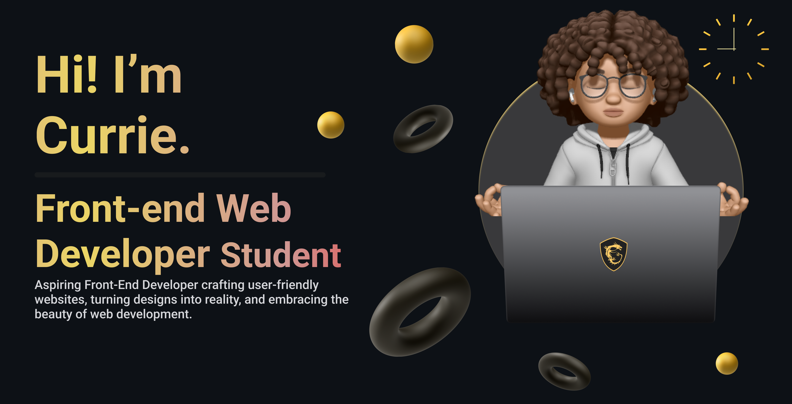

<h1 align="center">Hi 👋, I'm Currie!</h1>
<h3 align="center">An aspiring programmer focusing on front-end development</h3>

- 🌱 I’m currently learning **React**

- 👨‍💻 All of my projects are available at [https://github.com/CurrieParinas](https://github.com/CurrieParinas)

- 📫 How to reach me **currie2103@gmail.com**

- ⚡ Fun fact **I am a goldfish.**

<h3 align="left">Connect with me:</h3>

<h3 align="left">Languages and Tools:</h3>

          

&nbsp;

